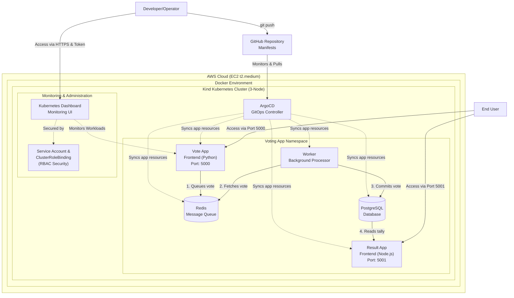

# GitOps-Driven Multi-Tier Kubernetes Deployment

## Introduction

This repository contains a complete, end-to-end GitOps deployment project, built as part of an ongoing cloud and DevOps engineering journey. It demonstrates how to automate the deployment of a multi-tier application on a local Kubernetes cluster hosted on an AWS EC2 instance. By utilizing ArgoCD, the infrastructure automatically syncs with the manifests in this repository, ensuring a single source of truth, automated monitoring, and self-healing deployments.

---

## Architecture Diagram

- **Traffic Flow:**

1. **Developer** pushes Kubernetes manifests to **GitHub**.
2. **ArgoCD** continuously monitors the repository for changes.
3. ArgoCD syncs and deploys resources to a **3-Node Kind Cluster** running on **AWS EC2**.
4. **Users** access the Voting App (Frontend) and Results App via exposed NodePorts.

---

## Tech Stack

* **Cloud Provider:** AWS (EC2 `c7i-flex.large (2vCPU, 4GiB Memory)` for multi-node capacity)
* **Containerization:** Docker
* **Kubernetes Environment:** Kind (Kubernetes in Docker, similar to minicube)
* **Continuous Deployment (GitOps):** ArgoCD
* **Monitoring:** Official Kubernetes Dashboard
* **Application Stack:** Python (Voting App), Node.js (Results App), Redis (Message Broker), PostgreSQL (Database)

---

## Repository Structure
All the necessary files to spin up and configure the cluster are organized as:
* `kind-k8s/` : Contains all required shell scripts (`.sh`), Kubernetes manifests (`.yml`), and command cheat sheets (`commands.md`).
* `images/` : Architecture diagrams and screenshots.
* `README.md` : Project documentation.
* `k8s-specifications/`: Contains all the Kubernetes manifests required to run the multi-tier application.

---

## Steps to Deploy

### Step 1. Provision Infrastructure
Launch an Ubuntu `c7i-flex.large` (2vCPU, 4GiB Memory) EC2 instance on AWS. Ensure ports `80`, `443`, `8080`, `5000`, `5001`, and `8443` are allowed in your Security Group's inbound rules.

### Step 2: Install Prerequisites
* Update System Packages: Update the package manager on your EC2 instance to ensure you are pulling the latest software versions.
* Install Docker: Download and install the Docker engine. Since we are using Kind (Kubernetes in Docker), Docker acts as the foundational layer that will host our cluster nodes.

* Configure Permissions: Add your current system user to the Docker user group. This allows you to execute Docker commands seamlessly without needing to type sudo every time.
* Apply Group Changes: Refresh your user's group assignments so the new Docker permissions take effect immediately without requiring a logout.

### Step 3: Setup Kubernetes Cluster (Kind) & Kubectl
* Download Kind: Fetch the Kind binary file directly from the official release repository. (available in provided install-kind.sh file)
* Make Executable: Modify the file permissions of the .sh file so the system recognizes it as an executable program.

* Create the Cluster: Instruct Kind to build a new Kubernetes cluster. Please refer given config.yml file that dictates the architecture—specifically, telling it to provision one control plane node and two worker nodes.

* Verify Kubectl: Ensure the Kubernetes command-line tool (kubectl) is installed so you can communicate with and manage your newly created cluster. (refer install_kubectl.sh file)

### Step 4: Install & Configure ArgoCD
* Create Namespace: Create a dedicated, isolated workspace (namespace) within your Kubernetes cluster specifically to hold all ArgoCD components.

* Deploy ArgoCD: Pull the official installation manifests from the Argo Project repository and apply them to your cluster. This spins up the various ArgoCD services and controllers inside the namespace you just created. (you will find it in commands.md file)

* Retrieve Credentials: By default, ArgoCD generates a secure, randomized admin password and stores it as a Kubernetes Secret. You will need to query the cluster for this specific secret and decode it to get your initial login password. (you will find it in commands.md file)

### Step 5: Deploy the Application via GitOps
* Access the UI: Make the ArgoCD dashboard accessible over the network, either by exposing its service as a NodePort or by setting up a port-forward.
* Log In: Open the ArgoCD web interface in your browser and authenticate using the default 'admin' username and the decoded password you retrieved in the previous step.

* Create Application Link: Inside ArgoCD, configure a "New App." You will provide the URL to your GitHub repository and point it to the exact folder containing your Voting App Kubernetes manifests.

* Initiate Sync: Trigger the synchronization process. ArgoCD will read the manifests from GitHub and automatically orchestrate the creation of your Redis, Postgres, Voting, and Result pods.

### Step 6: Expose the Application
* Forward Frontend Traffic: Map the internal Kubernetes port for the Voting application to a port on your EC2 instance, binding it to all network interfaces so it can accept external traffic.

* Forward Results Traffic: Repeat the port-forwarding process for the Results application on a separate port.

* Access the App: Open a web browser and navigate to your EC2 instance's public IP address (specifying the respective ports) to cast a vote and watch the results update in real-time.

### Step 7: Configure & Access the Kubernetes Dashboard
* Deploy the Dashboard: Apply the official Kubernetes Dashboard manifests to your cluster. This provisions all the necessary user interface services, core infrastructure pods, and networking components within a dedicated dashboard namespace.

* Generate Authentication Token: Request a secure, long-lived bearer token specifically for your newly created administrative user. Because the Kubernetes Dashboard is highly secure by default, you will need to copy this token to authenticate and bypass the login screen.

* Expose Dashboard Interface: Set up a network port-forwarding rule to map the dashboard's internal secure port (443) to an open port on your EC2 instance. Ensure it is bound to all network interfaces so it can receive inbound web traffic.

* Log In and Monitor: Open a web browser, navigate to your EC2 instance's public IP using a secure https:// connection, paste your generated authentication token into the login prompt, and begin monitoring your cluster workloads, replica sets, and pod status in real-time.

---

## Summary
This project successfully bridges core infrastructure setup with modern cloud-native deployment strategies. By containerizing a complex, multi-tier application and managing it strictly via GitOps principles, this setup provides a robust, scalable, and automated deployment pipeline without manual intervention in the cluster.

---

## Credits
Huge thanks to [TrainWithShubham](https://www.youtube.com/@TrainWithShubham) for the fantastic video tutorial that inspired and guided me for this project!
